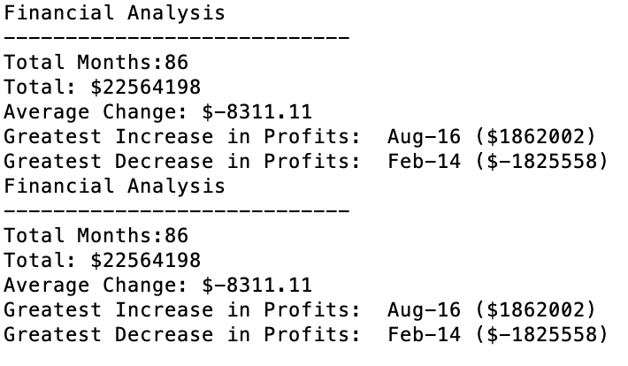

## PyPoll and PyBank

Analyzes Political and Financial Data using Python 

## Objectives

### Step 1 - PyPoll

* Create a Python script that analyzes the votes and calculates each of the following values:
    * The total number of votes cast
    * A complete list of candidates who received votes
    * The percentage of votes each candidate won
    * The total number of votes each candidate won
    * The winner of the election based on popular vote

### Step 2 - PyBank

* Create a Python script that analyzes the records to calculate each of the following values:
    * The total number of months included in the dataset
    * The net total amount of "Profit/Losses" over the entire period
    * The changes in "Profit/Losses" over the entire period, and then the average of those changes
    * The greatest increase in profits (date and amount) over the entire period
    * The greatest decrease in profits (date and amount) over the entire period

---------------------------------------------------

<b>Contact:</b> bronwynmilne64@gmail.com
